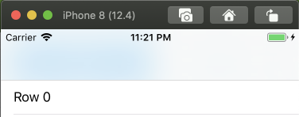

# UISearchControllers with scopes

Recently I was tasked with implementing a design that incorporated a [UISearchController](https://developer.apple.com/documentation/uikit/uisearchcontroller) with a scope bar. This design is useful when a user needs to be able to search a dataset and filter between multiple options (i.e. scopes). The scope bar is just a [UISegmentedControl](https://developer.apple.com/documentation/uikit/uisegmentedcontrol) that is maintained internally by the [UISearchBar](https://developer.apple.com/documentation/uikit/uisearchbar) which is a property of the UISearchController. You could just create your own UISearchBar and add it to your UIViewController's hierarchy but you'll be missing out on some features that UISearchController provides. The features we are most interested in here are the animations applied while scrolling or actively searching.

It looks something like this (depending on iOS version and customization options applied):


During implementation I ran into several issues which I am documenting here.

## Create a UIViewController with a UISearchController 
[c73b9fb](https://github.com/powerje/SearchController/commit/c73b9fb)

```swift
class ViewController: UITableViewController {

    private let searchController = UISearchController(searchResultsController: nil)

    override func viewDidLoad() {
        super.viewDidLoad()
        searchController.searchBar.scopeButtonTitles = ["Scope 1", "Scope 2"]
        navigationItem.searchController = searchController
    }
    // Code omitted for brevity, see the commit linked above for the entire class.
}
```

You might expect the scopes to show up at this point but they will not until `showsScopeBar` is set to `true` on the UISearchBar.

At this point the UISearchBar smartly animates away as the user scrolls:


## Add scopes and make them visible
[3e8e2f9](https://github.com/powerje/SearchController/commit/3e8e2f9)

Let's go ahead and set `showsScopeBar` to true so we can see our scopes:

```swift
    override func viewDidLoad() {
        super.viewDidLoad()

        searchController.searchBar.scopeButtonTitles = ["Scope 1", "Scope 2"]
        searchController.searchBar.showsScopeBar = true
        navigationItem.searchController = searchController
    }
```

This looks pretty good:


Until we start scrolling that is, the UISearchBar never completely collapses:


## UIScrollViewDelegate to the rescue
[d4a8d66](https://github.com/powerje/SearchController/commit/d4a8d66)

There is probably a better way to solve this but this is what I came up with 😅.

Because the UISearchBar animates away perfectly if there is no scope bar, let's try to detect when it _should_ begin to animate away and then hide the scopes, and bring them back at the right time as well:

```swift
    // HAX: this hides and shows the scope bar appropriately to allow
    // the system animation of the search bar to complete properly.
    private var lastContentOffset: CGFloat = 0
    override func scrollViewDidScroll(_ scrollView: UIScrollView) {
        let searchBar = searchController.searchBar

        if lastContentOffset > scrollView.contentOffset.y {
            // Scrolling down, show the scope bar.
            if !searchBar.showsScopeBar && searchBar.frame.size.height > 44 {
                searchBar.showsScopeBar = true
            }
        } else if lastContentOffset < scrollView.contentOffset.y {
            // Scrolling up, hide the scope bar to allow the searchBar to collapse
            // completely.
            if searchBar.showsScopeBar && searchBar.frame.size.height <= 44 {
                searchBar.showsScopeBar = false
            }
        }

        lastContentOffset = scrollView.contentOffset.y
    }
```

Here we are recording the direction the user is scrolling by maintaining the lastContentOffset of the UIScrollView whenever this method is called. When the user is scrolling to the top of the list we check to see if the searchBar is hidden and then that the searchBar's height is greater than 44 (this is the bit of the hack I am least comfortable with) - if those cases are met we show the scopeBar.

Conversely, if the user is scrolling towards the bottom of the list and we are showing the scope bar, and the searchBar height is less than or equal to 44 we hide the scopeBar, allowing the UISearchBar to animate itself away as the user continues this direction.


## Done right?
[bd686be](https://github.com/powerje/SearchController/commit/bd686be)

Okay, so this actually looks pretty good! Other than hard coding the expected UISearchBar height I feel fairly okay with this. So, we're done right?

Ugh, nope - this app  supports iOS 12 (otherwise we'd be using SwitchUI naturally!). What's this look like on iOS 12?

First, by default on iOS 12 the search functionality is hidden underneath the navigation bar by default. We could probably deal with that but this is what it looks like with our current code upon launching:



As we scroll there are some graphical glitches that look pretty bad:


## Okay, disable our hack for iOS 12
[ed3c8ac](https://github.com/powerje/SearchController/commit/ed3c8ac)

Okay, let's disable our hack for iOS 12 because it definitely looks bad there:

```swift
    // HAX: this hides and shows the scope bar appropriately to allow
    // the system animation of the search bar to complete properly.
    private var lastContentOffset: CGFloat = 0
    override func scrollViewDidScroll(_ scrollView: UIScrollView) {
        guard #available(iOS 13, *) else { return }
        let searchBar = searchController.searchBar

        if lastContentOffset > scrollView.contentOffset.y {
            // Scrolling down, show the scope bar.
            if !searchBar.showsScopeBar && searchBar.frame.size.height > 44 {
                searchBar.showsScopeBar = true
            }
        } else if lastContentOffset < scrollView.contentOffset.y {
            // Scrolling up, hide the scope bar to allow the searchBar to collapse
            // completely.
            if searchBar.showsScopeBar && searchBar.frame.size.height <= 44 {
                searchBar.showsScopeBar = false
            }
        }

        lastContentOffset = scrollView.contentOffset.y
    }
```

So if we're not on iOS 13+ we just return right away. This looks a lot better when scrolling, still not quite perfect but probably livable (and maybe correctable by getting rid of some transparent backgrounds):


But there's a serious issue if the user taps the search bar and then cancels the search. This causes the scopeBar to disappear entirely:


## Alright, iOS 12 gets a different experience
[154e1dc](https://github.com/powerje/SearchController/commit/154e1dc)

At this point I felt like throwing in the towel on iOS 12 is the right call. We can have a slightly different UX there while still maintaining a similar experience. The approach I took was to pin the search bar and scopes to the top of the screen always for iOS 12.

```swift
    override func viewDidLayoutSubviews() {
        defer { super.viewDidLayoutSubviews() }
        guard #available(iOS 13.0, *) else {
            searchController.hidesNavigationBarDuringPresentation = false
            // The cancel button has to go entirely, otherwise the scopes disappear _forever_
            // upon canceling - regardless of the setting above.
            searchController.searchBar.showsCancelButton = false
            // Have to make it active otherwise it overlaps with the cells of the UITableView.
            searchController.isActive = true
            return
        }
    }
```

You might prefer trying to do these steps in `viewDidLoad` but unfortunately that didn't change the broken behavior.

Prevent the navigation bar from attempting to animate away:

`searchController.hidesNavigationBarDuringPresentation = false` 

Hide the cancel button (to avoid scopes from disappearing upon canceling):

`searchController.searchBar.showsCancelButton = false`

Make the searchController active to prevent the search bar from hiding under the navigation bar:

`searchController.isActive = true`

With these settings in place on iOS 12 we have (admittedly more mundane) search+scopes behavior:


## Lessons Learned

UISearchController gives us some pretty neat animations that look great and feel right at home to users. Unfortunately there are some quirks that make it a more daunting solution to use than one would prefer. That said, it's probably worth the effort in this case. Unfortunately we're leaving iOS 12 users with a less aesthetic experience.

Did I miss anything obvious? Is there a better way to handle this? Please let me know by opening an issue here or reaching out on Twitter ([@powerje](https://twitter.com/powerje)).

Thanks for reading!